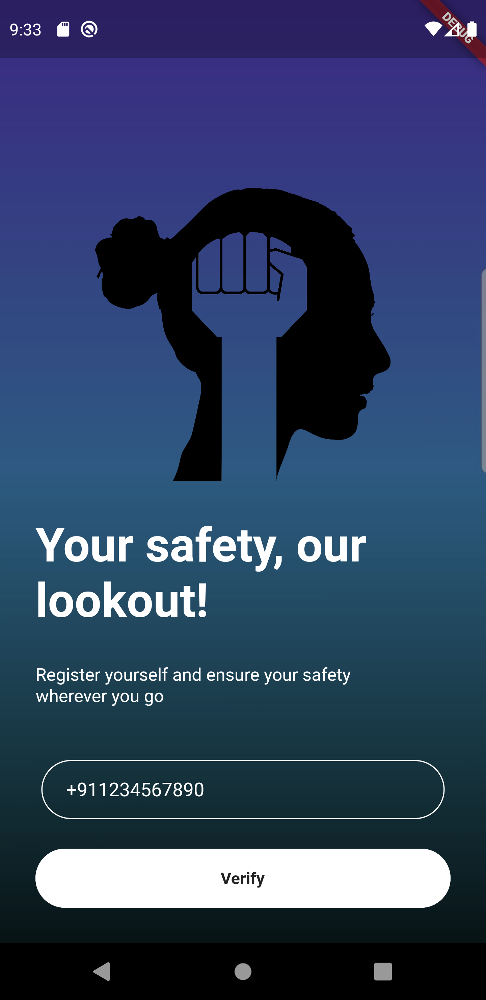
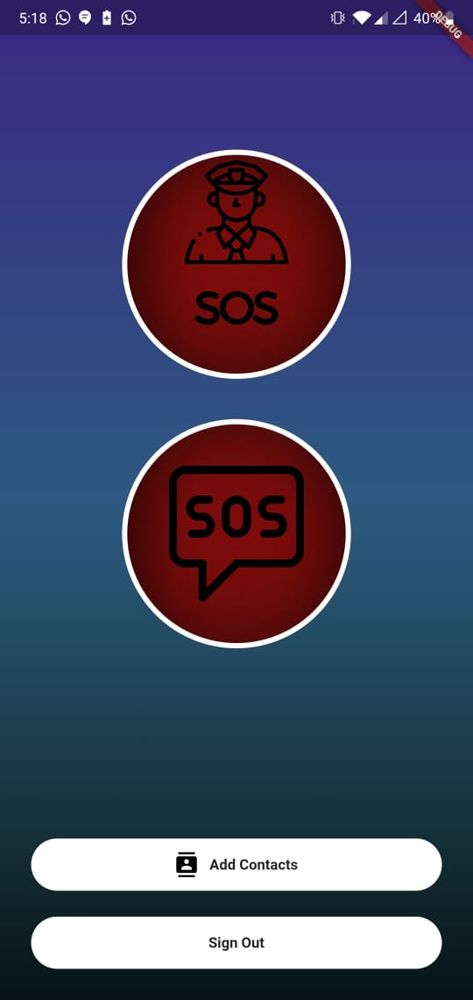

# Raksha - A Women Safety App👩🏻
Safety App for women made using FLUTTER and DART
The SOS button sends your accurate location to your added contacts.
Apart from the SOS button, added hardware buttons control has also been added so that the user can long press power and volume button at a time so that the message gets sent this way as well
Important numbers have been added as well for quick dialling whenever you are in distress ir case of emergency

                               

